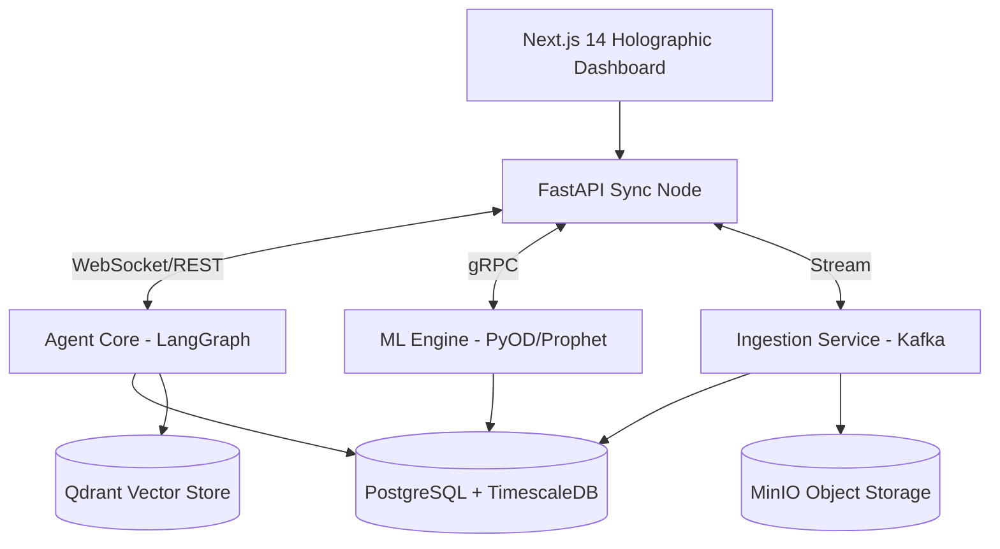

# ⚡ M A N T I S
### 🔮 Vigilant Infrastructure Guardian with Intelligent Lifecycle Management

<div align="center">
  
</div>

---

**MANTIS** is a next-generation, multi-agent AI platform built for the predictive intelligence of municipal infrastructure. Orchestrated by 6 specialized, LangGraph-powered LLM agents, MANTIS constantly monitors bridges, roads, water mains, and critical assets.

Operating with complete autonomy, MANTIS generates real-time alerts, files compliance paperwork, issues work orders, and dynamically predicts failure points before they impact the grid.

---

## 🌌 System Architecture 

> The core matrix integrates modern web frameworks, asynchronous backends, and multi-modal AI models into a singular, cohesive organism.



## 🤖 The 6 AI Operatives

| Operative | Designation | Primary Directive |
|:---|:---|:---|
| 🛡️ **Sentinel** | Anomaly Detection | Continuous sensor monitoring, >2 sigma variance flagging, multi-sensor correlation. |
| 🧠 **Analyst** | Risk Scoring | Deep root cause analysis, predictive failure modeling. |
| 🏗️ **Planner** | Maintenance | Automated work order generation, dynamic priority scheduling. |
| 📡 **Reporter** | Communications | Real-time Slack/Email dispatching, executive holograph summaries. |
| 💼 **Contractor** | Procurement | RFQ synthesis, automated bid comparison, contractor deployment. |
| ⚖️ **Regulator** | Compliance | Deadline tracking, regulatory reporting and cycle monitoring. |

## 🚀 Deployment Protocol

### 🌐 Deploying to Render (The Cloud Matrix)

Deploying MANTIS to [Render](https://render.com) is streamlined for maximum efficiency. 

**Prerequisites:**
1. A [Render Account](https://dashboard.render.com/register).
2. A connected GitHub repository containing this codebase.

**Step-by-Step Deployment:**

1. **Database Provisioning (Render Dashboard):**
   - Create a new **PostgreSQL** instance on Render.
   - Create a new **Redis** instance.
   - Note the Internal connection URLs for both.

2. **Backend Service (FastAPI):**
   - Click **New** -> **Web Service**.
   - Connect this repository.
   - Set **Build Command**: `pip install -r requirements.txt` (or appropriate if using poetry).
   - Set **Start Command**: `uvicorn main:app --host 0.0.0.0 --port 10000`.
   - Add Environment Variables:
     - `DATABASE_URL` (from step 1)
     - `REDIS_URL` (from step 1)

3. **Frontend Dashboard (Next.js):**
   - Click **New** -> **Web Service**.
   - Connect this repository.
   - Set **Root Directory**: `web`.
   - Set **Build Command**: `npm install && npm run build`.
   - Set **Start Command**: `npm start`.
   - Add Environment Variable:
     - `NEXT_PUBLIC_API_URL` (Set this to the URL of the backend service created in Step 2).

4. **Background Workers & ML:**
   - Create Render **Background Workers** for Celery and the ML services pointing to the respective directories with their start commands.

*MANTIS is now live on the global grid.* 🌍

---

## 💻 Local Sandbox Initialization

To run the MANTIS node locally:

```bash
# 1. Clone & Configure
git clone https://github.com/Senaaravichandran/mantis.git
cd mantis
cp .env.example .env

# 2. Ignite the Core
make up

# 3. Seed Simulation Data
make seed
```

> **Access Nodes:** Dashboard (`http://localhost:3000`) | API Docs (`http://localhost:8000/docs`)

---

## 📜 Directive License

Licensed under the **Apache License 2.0**. See the `LICENSE` databank for full terms.
